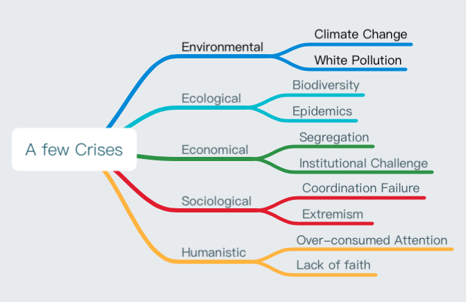

# Initiative towards Collaborative Society 

__The Vision: Technically Empower People to Collaborate Better__

See more at the [Manifesto](manifesto.md).

## Why this Vision

IMHO, it is how people communicate their thoughts and how people are organized to deliver the biggest assets of human civilization. 

Technologies like AGI and blockchain are the byproducts/tools. Organizations like company and government are the forms/means. 

It is how everyone is valued and matched, to take ownership to develop, under aligned interest and agreed principles, that matters more. 

### Challenges We Face

### The Root Cause

_It's not a solid conclusion._

The free market is supposed to optimize the resources to continuously improve productivity but it's falling short. Because there are information barriers in nature (most geographic) and then institutional (capitalism) for one to take advantage (which causes economic segregation), while people in the market are not all rational or capable to be rational. 

Internet and communication technology has helped reducing information barrier, which promotes global trading and the globalization. But our biologically limit of adaptability kicks in. We have limited attention and processing ability to catch up with the exploding information. We are anxious. We can increase the information density to drive people to learn faster and longer but there will be a ceiling. People will age and not everyone has the chance to be properly educated. Not to mention that education is challenged by the capital due to the attention economy and the anxiety of financial insecurity. 

## What Do We Do

Building an enterprise is one of the best ways to accumulate resources to empower people to be visionaries. As a community member with ownership (universal basic income + equity), we can focus on what's important, to build a corporation as a government (society), to best liberate everyone's productivity, to eventually create abundance for better tomorrow.

- Who: everyone who wants to be part.
- How: collaborate as a community, a corporation, a society.
- What for: liberate productivity to create abundance. 

### First Step

It sounds like a hopeless optimistic ideal. But it's possible and I'm making it feasible. Smarter minds like you can join force with [my roadmap](#how-do-we-do), or propose a better path.

We will collaborate on building tools and methodologies for ourselves, other companies, corporations, governments to communicate efficiently and effectively. 

## How Do We Do

### [A Toy Plan to Collaborate](Execution.md)

Remember, remember, the principles to be a member. 

__Principles__

- Autonomy
    - Social Contracts
    - Code of Conduct/Principles
        - We are a family, community, crowd-owners of a social company with diversity.
	- Trust first, but keep track of what happens.
        - Be bold, look for radical solution!
        - Be modest, `I know that I know nothing`.
        - Be honest and embrace changes, open source and open management based on credibility.
- Open Source, no NCA, NDA
    - Open Meeting
    - Open Decision
    - Open Development
- Open Management
    - Peer Review
    - Jury Decision
    - Liquid Democracy

`One can make the shape, but it is all together that can fill the gap.`

## What To Expect

In the big picture, guided by the Principle:

- A beautiful future to work towards.
- A meaningful purpose to live on.
- A community with trusted like-minds.
- A stage to liberate your talents.

In the short term, detailed in [Execution Plan](Execution.md#A-spice-about-the-economic-scence):

- Peace of mind with universal basic income.
- A share of equity matched to your added value.

Nothing is perfect but in Principles we unite. [QA thread](https://github.com/domijin/LibertyEarth/issues/3#issue-427262167).

### What's the future I expect?

- What's the Future of Manufacturing?
    - Can it be `on-demand`? Will there be less material cost and inventory?
    - Can it be `made local`? Will there be less packaging and energy cost in logistics?
    - Can it be `specialized to customization`? Is choice abundance and personal affiliation a unfulfilled demand?
    - Can I 
        - choose the fashion design, fit to body, print at local hub, pick up to go?
        - land in airport, pick up socks, travel, recycle the socks, fly out?
        - take chargers to re-engineer for new devices?
    - What's not in the `Cost`?
        - Externalities: do we miss out the waste, recycle cost in the price model?
        - Responsibility: we change from ownership to adoption for pets, should we also care for goods? 
- What's the Future of Education?
    - Can we learn more efficiently?
        - Can it be more `Adaptive`? Can information density be adjusted to the personal knowledge base?
        - Can it be more `Practical`? Can we learn from practice with the guide of the collective knowledge base?
    - What's the purpose of education?
        - Is it a necessity in the future of material abundance?
        - Can I just be curious to question until the edge of the collective knowledge base?
- What's the Future of Work? 
    - Do we need to be skilled when there is artificial general intelligence? 
    - Will there be income gap when experience of best practice can be supplemented by collective knowledge base?
    - What's the purpose of work in the Future of Manufacturing?
        - Do we still need to work to survive?
        - Can I be creative instead of productive when the demand is specialized?
- What's the Future of Society?
    - Is it safe to trust a person knowing one's principles?
    - Is it more trustworthy showing people one's principles?
    - ...

My peek to one of the [loosely-pictured future](http://future.domij.info).

## One More Thing

`I know that I know nothing` -- Socrates

- [Current Open Projects](https://github.com/domijin/LibertyEarth/projects)
	- Ideation with Q&A: happening at [issues](https://github.com/domijin/LibertyEarth/issues)
        - Privacy challenge
        - Trust challenge
	- A better walk-through of the vision, wording, language, etc.
	- Disclose the road-map towards collective society.
	- Test and iterate the [execution plan](Execution.md).
	- Better Name of the Project and a Website.

