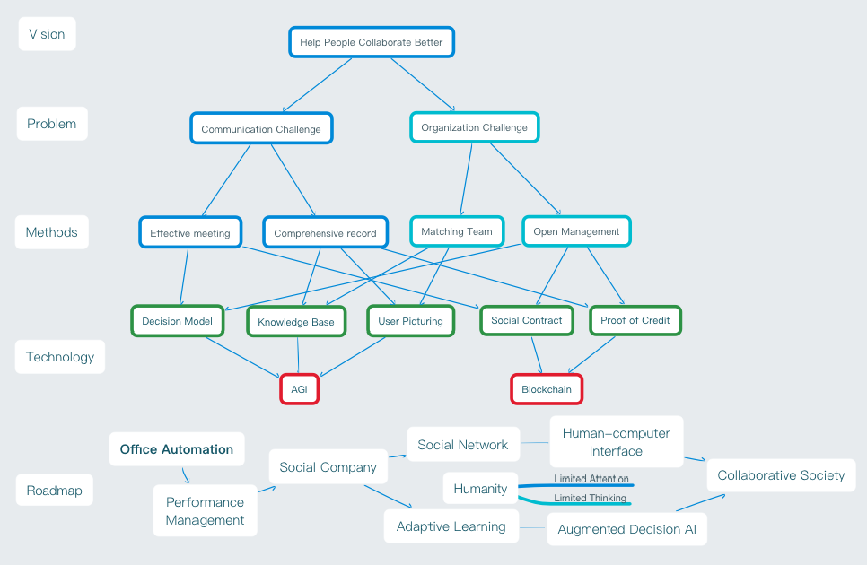

# Initiative towards Collaborative Society 

### __The Vision: Technically Empower People to Collaborate Better__

> It is very preliminary at the moment. I'm constantly detailing out and advocating for help. All questions or edits are welcome!

TOC

- Motivation: [Why This Vision](#why-this-vision)
- Idealistic Level
    - [Situation: Challenges We Face](#challenges-we-face)
    - [Reason: The Root Cause](#the-root-cause)
    - [Solution: What Do We Do](#what-do-we-do)
- Practical level: _To Be Edited_
    - Market (progressive goals)
    - Product (technology road map)
    - Execution Plan (sustainable business approach)
        - [Organization](#execution.md)
- [Manifesto](manifesto.md)

## Why This Vision

__Domi's Story__

In my humble opinion, it is `how people communicate their thoughts and how people are organized to deliver` the biggest asset of human civilization. 

Technologies like `artificial general intelligence` and `blockchain` are the byproducts (tools). Organizations like `corporations` and `governments` are the forms (means). 

It is how everyone is valued and matched, to take ownership to develop, under aligned interest and agreed principles, that matters more. 

More about Why: [Initiatives on Sociological Practice](http://dongming.uta.cloud/initiatives-on-sociological-practice.html)

__What's Your Story To Keep You Up In The Morning?__

## Idealistic Level

### Challenges We Face

__What's The Challenge Keeps You Up In The Night?__

### The Root Cause

__Domi's Thoughts__

Fundamental Trend: Larger educated populations are more frequently generating denser information through communication. 

- more information: larger networks with bigger population connected;
- faster generation: better connectivity with devices having more efficient human-computer interface;
- higher density: more intense competition drive deeper domain specified skills and experience through higher education. 

The Dilemma: Our adaptability (learning ability) are biologically limited, as

- limited attention (information I/O);
- limited computing（information processing).

Direct Consequences: Information Overload that results in divergent cognitive abilities:

- bias from selection effect over the process of learning; 
- redundant information rephrased from different sources that occupied limited attention;
- conflicting information that causes recursive cognitive processing cost.

In together with the `institutional barriers` detailed below, causes 

- personal `anxiety` of `career lock-in` due to solidified skill and experience with new tools and methods flushing in;
- `sociological segregation` due to difficulties to trace the source of divergence:
    - `fragmentation of Internet` that intensifies alienation;
    - expediting `economic segregation` that raises concerns;
    - democracy failure that discouraged voters with abusive attention occupation of marketing campaign and cognitive cost to identify fake news (bad faith);
    - collaboration difficulty to resolve global challenges without __effective communication__ with __comprehensive information__ and __constructive organization__ practical in larger scale. 

I believe `diversity` is `liberal` and `collaborative`, not discriminative or alienating. 

__Cause of `Institutional Barriers`__

The [free market](https://en.wikipedia.org/wiki/Free_market) is supposed to optimize the supply and demand without intervention. But information asymmetry naturally exists, which inspired capitalism to take advantage to build `institutional barriers`. Such institutional barriers include, but not limited to military (politics, policies, ideologies), economics (capitals, market power, information), technology (patents, IPs, manufacturing techniques). 

The economic and sociological segregations are then rationalized with [Darwinism](https://en.wikipedia.org/wiki/Darwinism) for the favor of politicians, capitalists, institutions that also fosters religionists, nationalists, racists, sexists, etc.

Any minority faces [inequality bargaining power](https://en.wikipedia.org/wiki/Inequality_of_bargaining_power) due to the information asymmetry caused by `institutional barriers`.

My abstraction of `Industrial Revolution` & `Renaissance`:

1. Printing: Enlightenment, less rational barrier due to geographic isolation.
2. Mechanization, steam power: Industrial Revolution 1.0, more productivity with less labor dependency.
3. Publishing: Romanticism, less educational barrier due to sociological status.
4. Mass production, electricity: Industrial Revolution 2.0, more productivity with less gender, age, physical status dependency.
5. Transportation, telegram: Darwinian, less information barrier due to transportation efficiency.
6. Computer, automation: Industrial Revolution 3.0, more productivity with less economic status dependency. 
7. Internet, communication technology: Marketism (Capitalism/Socialism with market adaption), less information barrier due to social network limit.  
8. Artificial general intelligence, adaptive learning, general purpose robotics: Industrial Revolution 4.0, more productivity with less skill, knowledge dependency.
9. Smart social contract, social identity & credit system: Collaborative society, less opportunity barrier due to sociological status.
10. [To be imagined...](#what-to-expect)

## What Do We Do

__Domi's Plan__

> This part is still under reconstruction: 1. bottom-up way to demonstrate how it can be done; 2. top-down way to demonstrate why I think so. Both are illuminated in the mind note map. 

> Why? My motivation is covered [earlier](#why-this-vision). I also realize that a collaborative society is worth living in that no matter who and how it's been built. And one of the key principle is be [open enough to embrace changes](https://github.com/domijin/LibertyEarth/issues/3). AMA there because at one point, histories are being made regardless. 

To break the `institutional barrier` mentioned above, the radical solution will be improve the biological limit of adaptability. But biological changes don't and won't catch up with the timescale of societal evolution any more, due to the fundamental difference of information propagation speed. 

Thus the only possibility I see is giving everyone the access to `Augmented Decision AI` to augment one's decision making ability in a process of `Adaptive Learning`, which involves retrieving information from the collective knowledge base of human civilization and providing decision suggestions with reasonings, through wearable `Human-computer Interface` based on the personal knowledge base, [draft of the R&D plan](images/R&D.png). At the same time, the society needs to be organized with trust and __principles__ to balance `liberty` between individuals and communities. 

Building an enterprise is one of the best ways to accumulate resources to empower people to be visionaries. It is also the only way to demonstrate the power of collaborative society when the current form of corporations and governments are reaching the ceiling of efficiency. As a community member with ownership (universal basic income + equity), individuals will be best motivated. With principles to let everyone keeps up and gets involved in decision based on the proved ability. We can focus on what's important, to build a corporation as a government (society), to best liberate everyone's productivity, to eventually create abundance for better tomorrow.

- Who: everyone who wants to be part.
- How: collaborate as a community, a corporation, a society.
- What for: liberate productivity to create abundance. 

Revisit the [Vision](#why-this-vision) and be a part in finding the path towards future with us.

### First Step

It sounds like a hopeless optimistic ideal. But it's possible and I'm making it feasible. Smarter minds like you can join force with [my road map](#how-do-we-do), or propose a better path.

We will collaborate on building tools and methodologies for ourselves, other companies, corporations, governments to communicate efficiently and effectively. 

### How To Participate?

Anyone should be a part of the collaborative society, which aims to provide help to liberate everyone, with equal access to the information and basic resources, until catching up by adaptive learning, to become capable, to extend the edge of the collective knowledge base. 

All supports are recognized!

1. `star` this project as pledge to support
2. join the [mail list](https://forms.gle/pnVim3XRBUrbn54FA)
3. ask challenging questions at [issues](https://github.com/domijin/LibertyEarth/issues)
4. pioneer in slack channel, ask for an [invitation](mailto:social@domij.info)
    1. talk to any community members for detail
    2. ask challenging questions
    3. help congregate into WiKi to iterate the plan
5. initiate the community principles in slack following the [execution plan](Execution.md) 
6. brainstorm the future of society (how people collaborate), future of education (how people adapt), future of manufacturing (how people prosper), future of future (where are we going), as well as who we are.
7. sign up as future development support
    1. knowledge graph
    2. embedded system developer: biometrics, acoustics, battery
    3. education theory (adaptive learning)
    4. mathematician, economist, sociologist, anthropologist, philosopher, PhDs, Post-Docs, Professors in other domains
    5. chip designers: quantum computing, photonic integrated circuits, biological computing
8. join as first actors
    1. _disciples_: visionaries in all backgrounds
    2. product managers
    3. speech recognition exports
    4. data engineers: cloud infrastructure
    5. data analytics/business intelligence
    6. iOS/Android developers
    7. decentralized system developers
    8. business developments

## How Do We Do

### [A Toy Plan to Collaborate](Execution.md)

Remember, remember, the principles to be a member. 

__Principles__

- Autonomy
    - Social Contracts
    - Code of Conduct/Principles
        - We are a family, community, crowd-owners of a social company with diversity.
	- Trust first, but keep track of what happens.
        - Be bold, look for radical solution!
        - Be modest, `I know that I know nothing`.
        - Be honest and embrace changes, open source and open management based on credibility.
- Open Source, no NCA, NDA
    - Open Meeting
    - Open Decision
    - Open Development
- Open Management
    - Peer Review
    - Jury Decision
    - Liquid Democracy

`One can make the shape, but it is all together that can fill the gap.`

## What To Expect

In the big picture, guided by the Principle:

- A beautiful future to work towards.
- A meaningful purpose to live on.
- A community with trusted like-minds.
- A stage to liberate your talents.

In the short term, detailed in [Execution Plan](Execution.md#A-spice-about-the-economic-scence):

- Peace of mind with universal basic income.
- A share of equity matched to your added value.

Nothing is perfect but in Principles we unite. [QA thread](https://github.com/domijin/LibertyEarth/issues/3#issue-427262167).

### What's the future I expect?

- What's the Future of Manufacturing?
    - Can it be `on-demand`? Will there be less material cost and inventory?
    - Can it be `made local`? Will there be less packaging and energy cost in logistics?
    - Can it be `specialized to customization`? Is choice abundance and personal affiliation a unfulfilled demand?
    - Can I 
        - choose the fashion design, fit to body, print at local hub, pick up to go?
        - land in airport, pick up socks, travel, recycle the socks, fly out?
        - take chargers to re-engineer for new devices?
    - What's not in the `Cost`?
        - Externalities: do we miss out the waste, recycle cost in the price model?
        - Responsibility: we change from ownership to adoption for pets, should we also care for goods? 
- What's the Future of Education?
    - Can we learn more efficiently?
        - Can it be more `Adaptive`? Can information density be adjusted to the personal knowledge base?
        - Can it be more `Practical`? Can we learn from practice with the guide of the collective knowledge base?
    - What's the purpose of education?
        - Is it a necessity in the future of material abundance?
        - Can I just be curious to question until the edge of the collective knowledge base?
- What's the Future of Work? 
    - Do we need to be skilled when there is artificial general intelligence? 
    - Will there be income gap when experience of best practice can be supplemented by collective knowledge base?
    - What's the purpose of work in the Future of Manufacturing?
        - Do we still need to work to survive?
        - Can I be creative instead of productive when the demand is specialized?
- What's the Future of Society?
    - Is it safe to trust a person knowing one's principles?
    - Is it more trustworthy showing people one's principles?
    - ...

My peek to one of the [loosely-pictured future](http://future.domij.info).

## One More Thing

`I know that I know nothing` -- Socrates

- [Current Open Projects](https://github.com/domijin/LibertyEarth/projects)
	- Ideation with Q&A: happening at [issues](https://github.com/domijin/LibertyEarth/issues)
        - Privacy challenge
        - Trust challenge
	- A better walk-through of the vision, wording, language, etc.
	- Disclose the road-map towards collective society.
	- Test and iterate the [execution plan](Execution.md).
	- Better Name of the Project and a Website.

